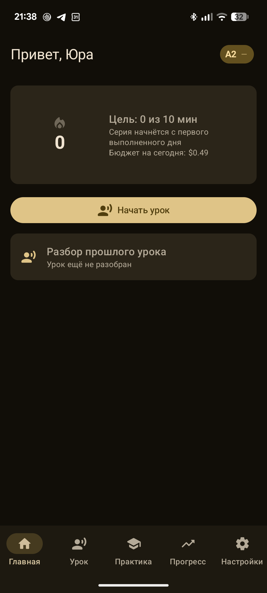
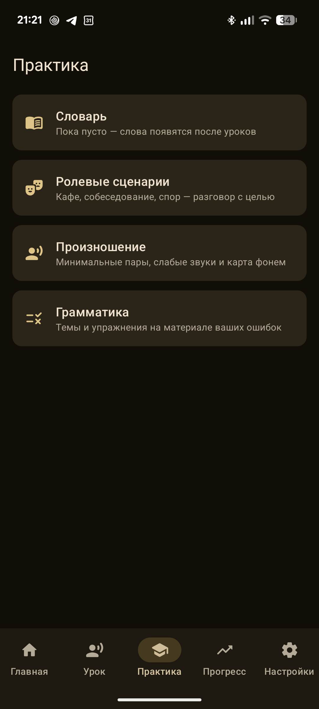
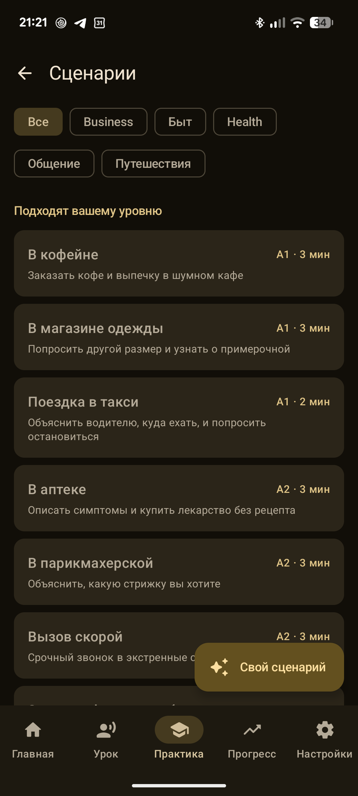
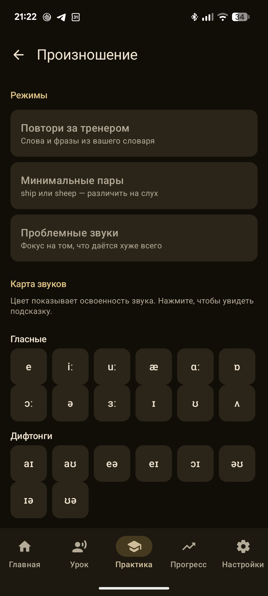
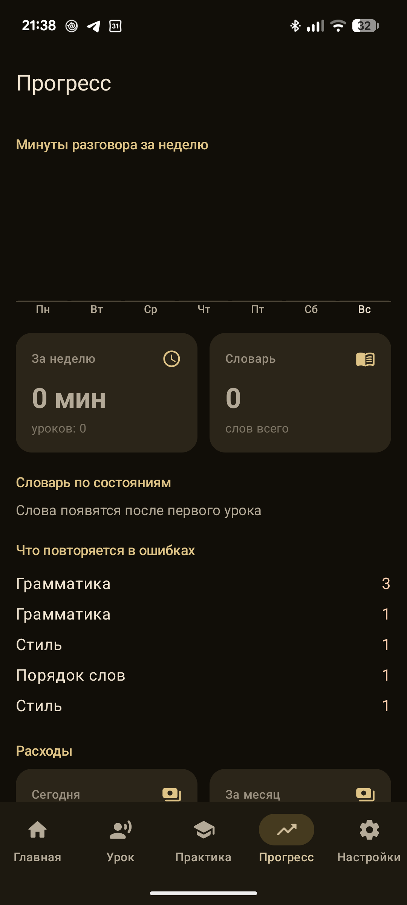

<div align="center">

# PersonalLangMaster

**Личный ИИ-репетитор английского — для себя и своей семьи.**

Разговор голосом в реальном времени, мягкие поправки по ходу беседы
и разбор после урока, который превращает ваши же ошибки в карточки,
упражнения и работу над произношением.

[](https://kotlinlang.org)
[](https://developer.android.com/jetpack/compose)
[](https://ai.google.dev/gemini-api/docs/live)
[](https://developer.android.com)
[](#тестирование)

</div>

---

## Что это

Приложение, которое имитирует разговор с живым преподавателем. Вы говорите — тренер
отвечает голосом, поправляет ошибки ровно настолько, насколько вы сами разрешили,
и запоминает, что у вас не получается.

Главный принцип: **всё в приложении питается вашими собственными ошибками.**
Никаких абстрактных курсов — темы грамматики, карточки словаря и упражнения
берутся из ваших же разговоров.

```
Разговор с тренером (Gemini Live, голос)
   │  мгновенные поправки по ползунку строгости
   │  тренер молча сохраняет слова и отмечает ошибки
   ▼
Разбор после урока (структурированный JSON)
   │  ошибки · оценка CEFR · слова «взять в актив»
   ▼
        ┌──────────────┬───────────────┬──────────────────┐
   словарь (SRS)   грамматика     произношение      прогресс
   карточки        темы и         минимальные       минуты, серия,
   с интервалами   упражнения     пары и звуки      расходы
        └──────────────┴───────────────┴──────────────────┘
   ▼
Профиль обновляется → следующий урок знает о вас больше
```

Проект сделан для личного использования, не для публикации в магазинах.
Ключ Gemini у каждого свой, никакого backend и никакой телеметрии.

---

## Возможности

### Живой урок
- Разговор голосом через **Gemini Live API** по WebSocket: PCM 16 кГц на вход, 24 кГц на выход.
- Три режима микрофона: удержание кнопки, одно нажатие с автоотправкой по тишине,
  hands-free. Перебить тренера можно в любой момент.
- Субтитры обеих сторон, карточки поправок прямо по ходу разговора.
- Урок продолжается при погасшем экране: передний сервис с таймером в уведомлении.
- Переподключение при обрыве связи с сохранением контекста беседы.
- Локальный детектор речи не отправляет тишину — это экономит входные токены в разы.

### Педагогика
- **Ползунок строгости** от «не поправлять вообще» до режима дрилла с перебиванием.
- Пять персон тренера, выбор голоса, акцента, темпа и многословности —
  поверх пресета всё настраивается вручную, вплоть до своего системного промпта.
- **Тест уровня**: пятиминутное интервью без поправок, по итогам которого ставится CEFR.
- Дальше уровень меняется осторожно — только по серии оценок подряд, и никогда
  не перепрыгивает через ступень.
- Память тренера: прошлые уроки, повторяющиеся ошибки, проблемные звуки
  и слова в проработке подставляются в системный промпт каждого урока.

### Практика между уроками — всё работает офлайн
- **Словарь** с интервальным повторением (SM-2) и четырьмя режимами: узнать перевод,
  вспомнить слово, произнести вслух, услышать и понять. Озвучка и распознавание системные,
  то есть бесплатные.
- **30 ролевых сценариев** (кафе, собеседование, врач, спор) с ролями, целью и критериями
  успеха; свой сценарий создаётся из одной фразы по-русски.
- **Тренажёр произношения**: повтор за тренером, минимальные пары на слух, фокус на слабых
  звуках и карта из 44 фонем, окрашенная по освоенности.
- **40 тем грамматики**, наверху — те, где вы реально ошибаетесь; упражнения генерируются
  пачкой на материале ваших ошибок и дальше работают без сети.

### Контроль и приватность
- Счётчик токенов и денег, **дневной и месячный лимиты** с выбором поведения:
  предупредить, мягко завершить урок или заблокировать до завтра.
- Родительский PIN на настройки ключа, модели и лимитов.
- Ключ API шифруется ключом из Android Keystore и не покидает устройство.
- Транскрипты и аудиозаписи хранятся ровно столько, сколько вы указали; по умолчанию
  аудио не записывается вовсе.
- Напоминания, серия дней и цель по минутам — уведомление молчит, если цель уже выполнена.

---

## Как выглядит

<div align="center">

| Главная | Практика | Сценарии |
|:---:|:---:|:---:|
|  |  |  |

| Произношение | Прогресс |
|:---:|:---:|
|  |  |

</div>

---

## Быстрый старт

### Требования
- Android Studio (AGP 9.4+), JDK 17, Android SDK 37.
- Телефон с Android 10 и новее.
- Ключ **Gemini API** — бесплатно в [Google AI Studio](https://aistudio.google.com),
  раздел *Get API key*.

### Сборка

```bash
git clone https://github.com/YuraFilionchik/PersonalTeacher.git
cd PersonalTeacher

./gradlew assembleDebug          # сборка
./gradlew installDebug           # установка на подключённый телефон
./gradlew testDebugUnitTest      # юнит-тесты
```

Ключ в репозиторий класть **не нужно**: он вводится в самом приложении при первом запуске
или позже в *Настройки → Модель и ключ API*. Там же кнопка «Проверить ключ» —
она делает бесплатный запрос списка моделей и сразу говорит, принят ли ключ.

### Первый запуск
1. Онбординг: имя → интересы и цель → персона и голос → уровень → ключ → микрофон.
2. Вкладка **Урок** → «Пройти тест уровня» — пять минут беседы, по итогам ставится CEFR.
3. Дальше — обычные уроки; слова и ошибки сами разойдутся по разделу «Практика».

---

## Сколько это стоит

Тарифицируется только разговор с моделью; вся практика между уроками бесплатна.

| Что | Ориентир |
|:--|:--|
| Минута голосового разговора | ≈ **$0.021** |
| Урок на 10 минут | ≈ **$0.21** |
| Час непрерывной беседы | ≈ **$1.26** |
| Разбор урока, генерация упражнений | доли цента |
| Словарь, произношение, грамматика офлайн | $0 |

Тарифы редактируются в настройках — цены Google меняются, и приложение не должно
показывать устаревшие цифры. Подробный расчёт: [`docs/gemini_live_api.md`](docs/gemini_live_api.md).

---

## Архитектура

Однонаправленный поток данных: `UI (Compose) ← StateFlow ← ViewModel ← UseCase ← Repository ←
(Room | DataStore | Gemini)`. Зависимости собираются вручную в `AppContainer` —
граф маленький и плоский, генерация кода тут ничего не упрощает.

```
com.example.personallangmaster
├── ai/
│   ├── live/        WebSocket-протокол Live API, state-машина сессии, инструменты тренера
│   ├── text/        обычные вызовы модели со структурированным выводом
│   └── prompt/      сборка системной инструкции, персоны, уровни строгости
├── core/
│   ├── audio/       захват и воспроизведение PCM, энергетический VAD
│   ├── speech/      системные TTS и распознавание речи
│   ├── crypto/      Android Keystore для ключа API и PIN
│   ├── srs/         планировщик интервальных повторений
│   ├── cost/        тарифы и подсчёт стоимости
│   └── progress/    серия дней и цель
├── data/            Room (18 таблиц), DataStore, репозитории, сид-контент из assets
├── domain/          разбор урока, уровень, бюджет, генерация сценариев и упражнений
├── ui/              экраны и компоненты Compose
└── work/            напоминания и ночное обслуживание (WorkManager)
```

### Решения, о которых стоит знать

| Решение | Почему так |
|:--|:--|
| Ключ API вводит пользователь | В APK ключа нет; каждый член семьи ставит приложение со своим ключом |
| Push-to-talk по умолчанию | Hands-free дороже и быстрее сажает батарею |
| Практика на системных TTS и STT | Повторения должны работать в метро и не стоить ни цента |
| Разбор урока — отдельный текстовый вызов | Структурированный JSON вместо разбора речи регулярками |
| Ошибки ученика окрашены в `tertiary`, а не в `error` | Это учебная поправка, а не сбой приложения |
| Ручной DI вместо Hilt | Плоский граф; точка входа одна, миграция дешёвая |
| Имена моделей — в `ModelCatalog` и настройках | Они меняются чаще, чем выходят версии приложения |

---

## Стек

**Kotlin 2.2** · **Jetpack Compose** (Material 3, BOM 2026.09) · **Navigation 3** ·
**Room 2.7** (KSP) · **DataStore** · **OkHttp** (WebSocket) · **kotlinx.serialization** ·
**WorkManager 2.11** · **Coroutines/Flow**

`minSdk 29` · `targetSdk 36` · `compileSdk 37` · JDK 17 · Gradle 9.6

Модели: `gemini-3.8-live` для голоса, `gemini-3.8-flash` для разборов,
`gemini-3.5-flash-lite` для мелких задач — всё переключается в настройках.

---

## Тестирование

```bash
./gradlew testDebugUnitTest
```

**131 юнит-тест**, без единого обращения к сети. Покрыто то, что ломается тихо
и дорого:

- протокол Live API — на записанных ответах сервера;
- сборка системного промпта: настройки строгости и режимов реально доезжают до инструкции;
- планировщик SM-2 и мост между карточкой в базе и планировщиком;
- правила изменения уровня и лимитов расходов;
- подсчёт стоимости — сверен с расчётами из документации;
- обработка PCM и детектор речи — на синтетических сигналах.

Живая сессия отлаживается без затрат: в отладочной сборке есть записанный урок
и фейковая сессия, проигрывающая его по таймингам.

---

## Документация

| Файл | О чём |
|:--|:--|
| [`docs/IMPLEMENTATION_PLAN.md`](docs/IMPLEMENTATION_PLAN.md) | Полный план: продукт, архитектура, модель данных, каталог настроек, этапы |
| [`docs/gemini_live_api.md`](docs/gemini_live_api.md) | Протокол Live API, расчёт токенов и стоимости |
| [`docs/PARALLEL_TASKS.md`](docs/PARALLEL_TASKS.md) | Нарезка изолированных задач для параллельной разработки |

---

## Статус

| Этап | Состояние |
|:--|:--|
| M0 — сборка и каркас | ✅ |
| M1 — данные, профиль, шифрование ключа | ✅ |
| M2 — настройки целиком | ✅ |
| M3 — живая сессия Gemini Live | ✅ |
| M4 — разбор урока и уровень | ✅ |
| M5 — словарь и повторения | ✅ |
| M6 — сценарии, произношение, грамматика | ✅ |
| M7 — прогресс, лимиты, напоминания | ✅ |
| M8 — планшеты, перенос профиля, релизная сборка | в работе |

Приложение используется на реальных устройствах; известные ограничения и то,
что ещё не проверено вживую, отмечены прямо в плане реализации.

---

<div align="center">
<sub>Личный проект. Не для продажи и не для публикации в магазинах приложений.</sub>
</div>
