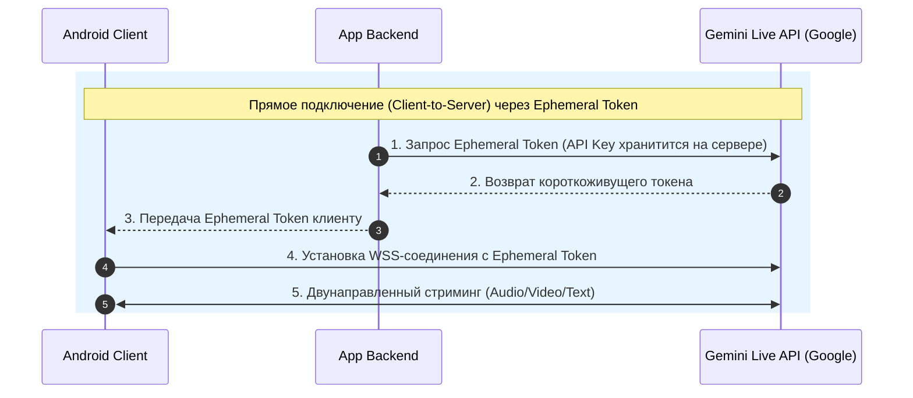

# Документация по Gemini Multimodal Live API и расчет стоимости использования

## 1. Введение и общие сведения

**Gemini Multimodal Live API** — это интерфейс от Google, обеспечивающий низколатентное потоковое взаимодействие в реальном времени с использованием голоса, видео и текста. В отличие от стандартного REST API (`GenerateContent`), Live API работает по протоколу **WebSocket** (двунаправленное потоковое соединение), что позволяет вести диалог с искусственным интеллектом в формате естественной человеческой беседы.

### Ключевые возможности:
* **Двунаправленный потоковый ввод и вывод (Bidirectional Streaming):** Одновременная передача аудио с микрофона и видео с камеры и получение синтезированной речи модели с минимальной задержкой.
* **Перебивание модели (Barge-in):** Пользователь может перебить AI в любой момент, произнеся фразу. Модель автоматически приостановит генерацию речи и переключится на прослушивание.
* **Синхронная транскрипция (Transcriptions):** Параллельное получение текстовых расшифровок как речи пользователя, так и ответов модели.
* **Вызов инструментов (Tool Use / Function Calling):** Модель может вызывать функции приложения во время потоковой трансляции.
* **Многоязычность:** Поддержка более 70 языков (включая русский, английский и т.д.).
* **Аффективный диалог (Affective Dialog):** Адаптация тональности, интонации и стиля речи в зависимости от эмоций пользователя.

---

## 2. Технические характеристики и Протокол

### Протокол подключения
* **Тип соединения:** Stateful WebSocket (`WSS`).
* **Эндпоинт:** `wss://generativelanguage.googleapis.com/ws/google.ai.generativelanguage.v1alpha.GenerativeService.BidiGenerateContent`
* **Альтернатива (Interactions API):** `https://generativelanguage.googleapis.com/v1beta/interactions`

### Спецификации входящих и исходящих данных (Formatting)

| Модальность | Направление | Формат и спецификации | Поток данных (Bitrate) |
| :--- | :--- | :--- | :--- |
| **Аудио (Вход)** | Client $\rightarrow$ Server | Raw PCM 16-bit, **16 kHz**, Mono, Little-Endian | ~32 КБ/сек (256 кбит/с) |
| **Видео/Камера (Вход)** | Client $\rightarrow$ Server | JPEG/PNG кадры (оптимально **1 FPS**) | Зависит от разрешения и сжатия |
| **Текст (Вход)** | Client $\rightarrow$ Server | Текстовые чанки в JSON | Незначительный |
| **Аудио (Выход)** | Server $\rightarrow$ Client | Raw PCM 16-bit, **24 kHz**, Mono, Little-Endian | ~48 КБ/сек (384 кбит/с) |
| **Текст (Выход)** | Server $\rightarrow$ Client | Текстовая транскрипция ответа модели | Незначительный |

---

## 3. Архитектура подключения и Безопасность

### Схемы интеграции для Android



1. **Client-to-Server (Рекомендуется для минимальной задержки):**
   * Мобильное приложение напрямую устанавливает WebSocket-соединение с Gemini API.
   * **Безопасность:** Запрещено вшивать мастер-ключ API (`API Key`) в приложение! Для этого backend приложения запрашивает в Google AI Studio короткоживущий токен (**Ephemeral Token**) и передает его клиенту.

2. **Server-to-Server:**
   * WebSocket открывает сервер приложения, проксируя аудипотоки от клиента к Gemini.
   * Увеличивает задержку (RTT), но позволяет жестко контролировать трафик и валидировать данные.

---

## 4. Расчет токенов и Тарифная сетка (Pricing)

Gemini API тарифицируется на основе входящих и исходящих **токенов** (учитываются текст, аудио, изображения/видео и кэш контекста).

### Коэффициенты конвертации медиа в токены

* **Аудио Вход:** 1 секунда аудио $\approx$ **25 токенов** ($\approx$ 1 500 токенов в минуту).
* **Аудио Выход:** 1 секунда сгенерированной речи $\approx$ **50 токенов** ($\approx$ 3 000 токенов в минуту).
* **Видео/Изображения Вход:** 1 кадр (JPEG) $\approx$ **258–300 токенов**.
  * При частоте **1 FPS** (1 кадр в секунду) $\approx$ 258 токенов/сек $\approx$ **15 480 токенов в минуту**.
* **Текст:** 1 токен $\approx$ 4 символа (или ~0.75 слова).

### Актуальная стоимость Gemini Live / Multimodal API (Pay-as-you-go)

> [!NOTE]
> В **Free Tier (Google AI Studio)** предоставляется бесплатный доступ с ограничениями по частоте запросов (например, до 15 RPM, 1M TPM). Для коммерческого использования используется уровень **Paid Tier (Pay-as-you-go)**.

| Тип данных / Модальность | Стоимость за 1 Million (1M) токенов | Эквивалентная стоимость за единицу времени |
| :--- | :--- | :--- |
| **Text Input** | $0.75 / 1M токенов | — |
| **Text Output** | $4.50 / 1M токенов | — |
| **Audio Input** | $3.00 / 1M токенов | **~$0.0045 / минута** ($0.27 / час) |
| **Audio Output** | $12.00 / 1M токенов | **~$0.0360 / минута** ($2.16 / час) |
| **Video/Image Input** | $1.00 / 1M токенов | **~$0.0155 / минута** (при 1 FPS) |
| **Context Caching (Создание)** | $0.075 / 1M токенов | Разово за кэшируемый контекст |
| **Context Caching (Хранение)** | $0.50 / 1M токенов в час | За поддержание кэша в памяти |

---

## 5. Расчет стоимости запросов и сессий приложения

Для оценки экономики приложения PersonalTeacher / PersonalLangMaster разберем типовые сценарии использования.

### Сценарий A: Голосовой диалог (Voice-Only Mode)
* **Условия:** Разговор с преподователем/AI. Пользователь говорит 30 секунд в минуту, AI отвечает 30 секунд в минуту.
* **Входные данные:**
  * Аудио-вход (30 сек): $30 \times 25 = 750$ токенов.
  * Текстовый системный промпт и контекст чата: ~250 токенов.
  * *Итого вход:* ~1 000 токенов/мин.
* **Исходящие данные:**
  * Аудио-выход AI (30 сек): $30 \times 50 = 1 500$ токенов.
  * *Итого выход:* ~1 500 токенов/мин.

#### Стоимость за 1 минуту диалога (Voice-Only):
$$\text{Cost}_{\text{input}} = \frac{1\,000}{1\,000\,000} \times \$3.00 = \$0.0030$$
$$\text{Cost}_{\text{output}} = \frac{1\,500}{1\,000\,000} \times \$12.00 = \$0.0180$$
$$\mathbf{\text{Итого за 1 минуту}} = \$0.0030 + \$0.0180 = \mathbf{\$0.0210\text{ (~2.1 цента)}}$$
* **Стоимость 10-минутного урока:** **~$0.21** (~19–20 рублей).
* **Стоимость 1 часа непрерывного разговора:** **~$1.26**.

---

### Сценарий B: Интерактивный урок с камерой (Multimodal Voice + Camera 1 FPS)
* **Условия:** Камера транслирует окружающие предметы или текст с частотой 1 FPS. Пользователь и AI активно общаются голосом.
* **Входные данные:**
  * Видео-поток (1 FPS = 60 кадров/мин): $60 \times 258 = 15 480$ токенов.
  * Аудио-вход (30 сек/мин): 750 токенов.
  * Системный контекст: 250 токенов.
  * *Итого вход:* ~16 480 токенов/мин.
* **Исходящие данные:**
  * Аудио-выход AI (30 сек/мин): 1 500 токенов.
  * *Итого выход:* 1 500 токенов/мин.

#### Стоимость за 1 минуту мультимодального сеанса:
$$\text{Cost}_{\text{video input}} = \frac{15\,480}{1\,000\,000} \times \$1.00 = \$0.0155$$
$$\text{Cost}_{\text{audio input}} = \frac{750}{1\,000\,000} \times \$3.00 = \$0.00225$$
$$\text{Cost}_{\text{audio output}} = \frac{1\,500}{1\,000\,000} \times \$12.00 = \$0.0180$$
$$\mathbf{\text{Итого за 1 минуту}} = \$0.0155 + \$0.00225 + \$0.0180 = \mathbf{\$0.03575\text{ (~3.6 цента)}}$$
* **Стоимость 10-минутного сеанса с камерой:** **~$0.36**.
* **Стоимость 1 часа с камерой:** **~$2.15**.

---

### Сценарий C: Оптимизация через Context Caching (Кэширование учебных материалов)
Если в приложение загружается книга, правила грамматики или словарь объем в 50 000 токенов:
* Без кэширования: Каждый запрос оплачивается с учетом полных 50 000 токенов ($50\,000 \times \$0.75 / 1M = \$0.0375$ за каждый вызов).
* С Context Caching:
  * Создание кэша: $50\,000 \times \$0.075 / 1M = \$0.00375$ (разово).
  * Хранение кэша в течение 1 часа: $50\,000 \times \$0.50 / 1M = \$0.025$ в час.
  * **Экономия на повторных запросах составит до 80–90%.**

---

## 6. Сводная таблица оценки бюджета приложения на масштаб (MAU)

Предположим, средний активный пользователь делает **10 уроков в месяц по 5 минут** (всего 50 минут разговора в месяц).

| Кол-во активных пользователей (MAU) | Минут разговора в месяц | Голосовой режим (Voice-Only) | Мультимодальный режим (Голос + Видео) |
| :--- | :--- | :--- | :--- |
| **100 пользователей** | 5 000 мин | ~$105 / мес | ~$178 / мес |
| **1 000 пользователей** | 50 000 мин | ~$1 050 / мес | ~$1 787 / мес |
| **10 000 пользователей** | 500 000 мин | ~$10 500 / мес | ~$17 875 / мес |

---

## 7. Практические рекомендации по оптимизации расходов в Android-приложении

1. **Использование VAD (Voice Activity Detection):**
   * Не отправлять молчание. Использовать локальный `WebRtcVad` или `Android Noise Suppressor` на клиенте и передавать аудиопакеты в WebSocket только тогда, когда обнаружен голос человека. Это снижает затраты на входной аудиопоток в 2–3 раза.

2. **Адаптивный FPS для видеопотока:**
   * Не передавать видео с фиксированной частотой 1 FPS непрерывно.
   * Отправлять кадры с камеры только при изменении сцены, по нажатию кнопки пользователя ("Посмотри на это") или раз в 3–5 секунд. Это снижает расходы на видео на 70–80%.

3. **Управление перебиванием (Barge-In):**
   * Когда пользователь перебивает AI, отправлять сигнал `interrupted` и мгновенно сбрасывать буфер воспроизведения на Android, чтобы не тратить входящий трафик и не просить продолжения сгенерированного ответа.

4. **Короткие Ephemeral-токены:**
   * Генерировать Ephemeral Tokens со временем жизни (TTL) 5–10 минут, ограниченные диапазоном доступных функций, для исключения компрометации API-ключа и несанкционированного расхода средств.

---

## 8. Спецификация API и Инструкция по использованию (Protocol Reference)

### 8.1. Формат WebSocket-сообщений

После установления WebSocket-соединения обмен сообщениями происходит в формате JSON.

#### 1. Первичное конфигурационное сообщение (`setup`)
Отправляется клиентом первыми байтами сразу после успешного подключения:

```json
{
  "setup": {
    "model": "models/gemini-2.0-flash-exp",
    "generationConfig": {
      "responseModalities": ["AUDIO", "TEXT"],
      "speechConfig": {
        "voiceConfig": {
          "prebuiltVoiceConfig": {
            "voiceName": "Puck"
          }
        }
      },
      "temperature": 0.7
    },
    "systemInstruction": {
      "parts": [
        {
          "text": "Ты — персональный репетитор иностранных языков PersonalTeacher. Разговаривай дружелюбно, исправляй ошибки пользователя и задавай уточняющие вопросы."
        }
      ]
    },
    "tools": [
      {
        "functionDeclarations": [
          {
            "name": "lookupDictionary",
            "description": "Получает перевод и определение слова в словаре",
            "parameters": {
              "type": "OBJECT",
              "properties": {
                "word": { "type": "STRING", "description": "Слово для поиска" }
              },
              "required": ["word"]
            }
          }
        ]
      }
    ]
  }
}
```

> **Доступные голоса (`voiceName`):** `Puck`, `Charon`, `Kore`, `Fenrir`, `Aoede`.

---

#### 2. Передача потокового аудио и кадров видео (`realtimeInput`)
Клиент отправляет чанки сырого аудио PCM (16 kHz) или кадры JPEG, закодированные в Base64:

* **Отправка аудио:**
```json
{
  "realtimeInput": {
    "mediaChunks": [
      {
        "mimeType": "audio/pcm;rate=16000",
        "data": "UklGRiQAAABXQVZFZm10IBAAAAABAAEA..."
      }
    ]
  }
}
```

* **Отправка кадра с камеры (1 FPS):**
```json
{
  "realtimeInput": {
    "mediaChunks": [
      {
        "mimeType": "image/jpeg",
        "data": "/9j/4AAQSkZJRgABAQEASABIAAD..."
      }
    ]
  }
}
```

---

#### 3. Отправка текстовых сообщений (`clientContent`)
Если пользователь вводит текст с клавиатуры:

```json
{
  "clientContent": {
    "turns": [
      {
        "role": "user",
        "parts": [
          {
            "text": "Объясни мне разницу между Present Perfect и Past Simple."
          }
        ]
      }
    ],
    "turnComplete": true
  }
}
```

---

#### 4. Ответ сервера (`serverContent`)
Сервер присылает ответные аудиочанки PCM (24 kHz) и текстовую транскрипцию ответа:

```json
{
  "serverContent": {
    "modelTurn": {
      "parts": [
        {
          "inlineData": {
            "mimeType": "audio/pcm;rate=24000",
            "data": "UklGRiQAAABXQVZFZm10IBAAAAABAAEA..."
          }
        },
        {
          "text": "Present Perfect используется, когда действие произошло в прошлом, но его результат важен сейчас..."
        }
      ]
    },
    "turnComplete": true,
    "interrupted": false
  }
}
```

* Если `interrupted: true`, это означает, что пользователь перебил AI (Barge-in), и воспроизведение текущей реплики нужно отменить.

---

#### 5. Вызов функций и инструментов (`toolCall` / `toolResponse`)

* **Запрос от Gemini к клиенту (`toolCall`):**
```json
{
  "toolCall": {
    "functionCalls": [
      {
        "name": "lookupDictionary",
        "args": {
          "word": "vocabulary"
        },
        "id": "call_abc123"
      }
    ]
  }
}
```

* **Ответ клиента на вызов функции (`toolResponse`):**
```json
{
  "toolResponse": {
    "functionResponses": [
      {
        "response": {
          "output": {
            "translation": "словарный запас",
            "example": "Expand your vocabulary every day."
          }
        },
        "id": "call_abc123"
      }
    ]
  }
}
```

---

### 8.2. Пример реализации WebSocket-клиента на Kotlin (OkHttp / Android)

Ниже представлен базовый пример подключения и обмена сообщениями на Android с использованием `OkHttpClient`:

```kotlin
import okhttp3.*
import okio.ByteString
import org.json.JSONObject
import java.util.concurrent.TimeUnit

class GeminiLiveWebSocketClient(
    private val apiKey: String,
    private val listener: GeminiLiveListener
) {
    private val client = OkHttpClient.Builder()
        .readTimeout(0, TimeUnit.MILLISECONDS)
        .build()

    private var webSocket: WebSocket? = null

    fun connect() {
        val url = "wss://generativelanguage.googleapis.com/ws/google.ai.generativelanguage.v1alpha.GenerativeService.BidiGenerateContent?key=$apiKey"
        val request = Request.Builder().url(url).build()

        webSocket = client.newWebSocket(request, object : WebSocketListener() {
            override fun onOpen(webSocket: WebSocket, response: Response) {
                sendSetupConfig()
            }

            override fun onMessage(webSocket: WebSocket, text: String) {
                handleServerMessage(text)
            }

            override fun onFailure(webSocket: WebSocket, t: Throwable, response: Response?) {
                listener.onError(t)
            }
        })
    }

    private fun sendSetupConfig() {
        val setupJson = JSONObject().apply {
            put("setup", JSONObject().apply {
                put("model", "models/gemini-2.0-flash-exp")
                put("generationConfig", JSONObject().apply {
                    put("responseModalities", org.json.JSONArray().put("AUDIO").put("TEXT"))
                    put("speechConfig", JSONObject().apply {
                        put("voiceConfig", JSONObject().apply {
                            put("prebuiltVoiceConfig", JSONObject().apply {
                                put("voiceName", "Puck")
                            })
                        })
                    })
                })
            })
        }
        webSocket?.send(setupJson.toString())
    }

    fun sendAudioChunk(pcm16Data: ByteArray) {
        val base64Data = android.util.Base64.encodeToString(pcm16Data, android.util.Base64.NO_WRAP)
        val json = JSONObject().apply {
            put("realtimeInput", JSONObject().apply {
                put("mediaChunks", org.json.JSONArray().put(JSONObject().apply {
                    put("mimeType", "audio/pcm;rate=16000")
                    put("data", base64Data)
                }))
            })
        }
        webSocket?.send(json.toString())
    }

    private fun handleServerMessage(text: String) {
        val json = JSONObject(text)
        if (json.has("serverContent")) {
            val serverContent = json.getJSONObject("serverContent")
            if (serverContent.optBoolean("interrupted", false)) {
                listener.onInterrupted()
                return
            }
            if (serverContent.has("modelTurn")) {
                val parts = serverContent.getJSONObject("modelTurn").getJSONArray("parts")
                for (i in 0 until parts.length()) {
                    val part = parts.getJSONObject(i)
                    if (part.has("inlineData")) {
                        val inline = part.getJSONObject("inlineData")
                        val base64Pcm = inline.getString("data")
                        val pcm24k = android.util.Base64.decode(base64Pcm, android.util.Base64.DEFAULT)
                        listener.onAudioReceived(pcm24k)
                    }
                    if (part.has("text")) {
                        listener.onTextTranscriptReceived(part.getString("text"))
                    }
                }
            }
        }
    }

    fun close() {
        webSocket?.close(1000, "User closed session")
    }

    interface GeminiLiveListener {
        fun onAudioReceived(pcm24kData: ByteArray)
        fun onTextTranscriptReceived(text: String)
        fun onInterrupted()
        fun onError(throwable: Throwable)
    }
}
```
